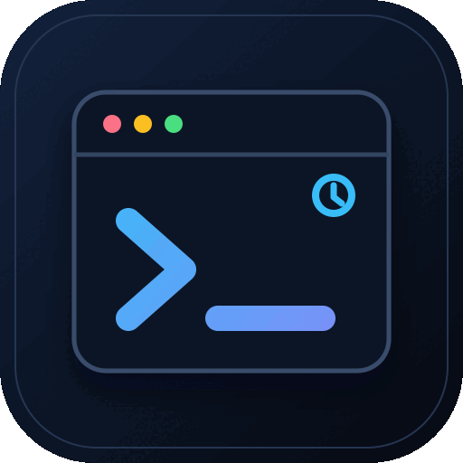
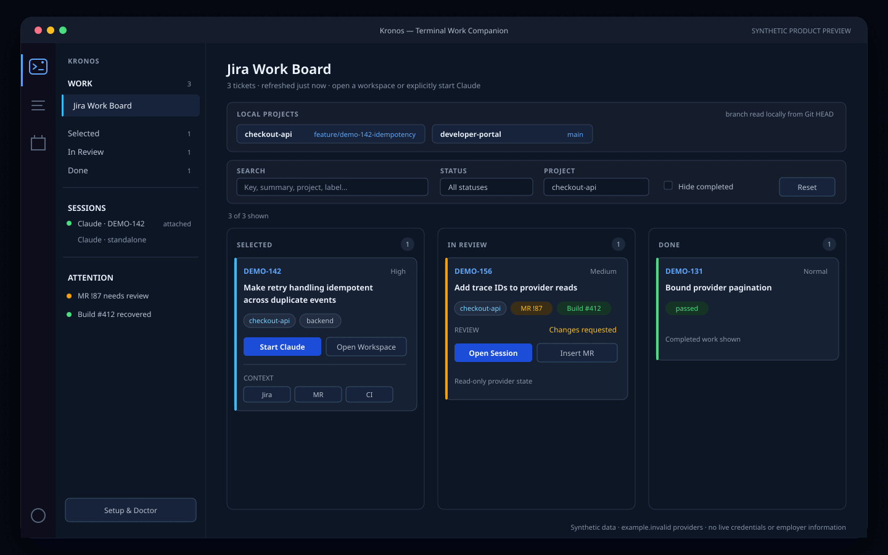
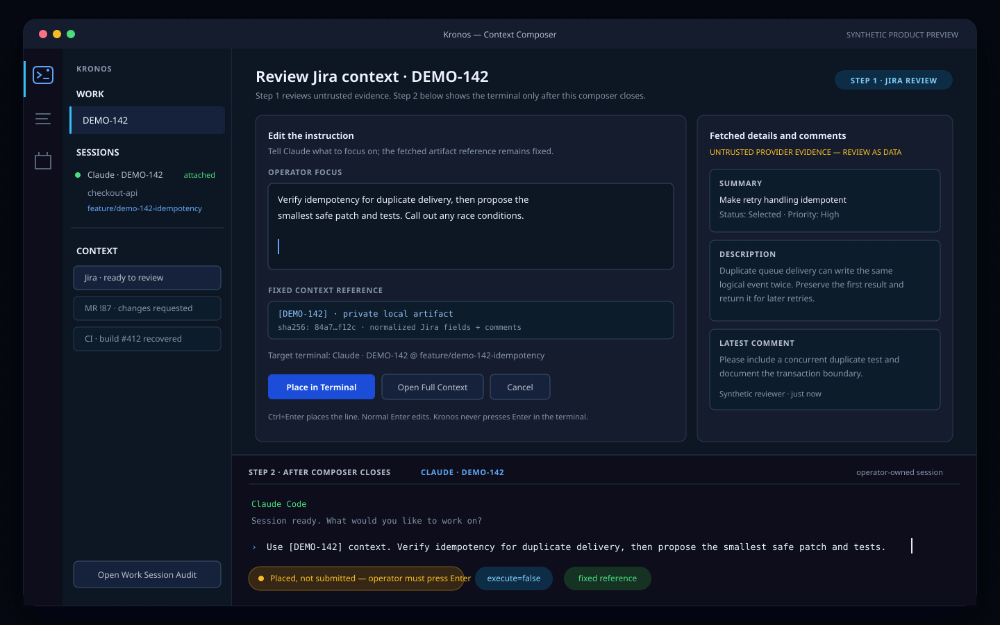
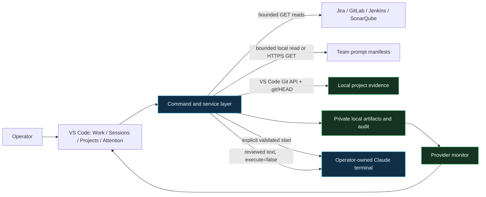

# Kronos — Terminal Work Companion

<p align="center">
  
</p>

<p align="center">
  A terminal-first VS Code companion that brings Jira, GitLab, Jenkins, and SonarQube evidence into operator-controlled Claude sessions.
</p>

<p align="center">
  
  
  
  
  
</p>

> **Preview software.** Kronos is ready for local evaluation, not represented as a Marketplace release or production service. The repository is source-available for portfolio review under the included [source-review license](LICENSE).



Kronos solves a narrow enterprise-development problem: the evidence needed for a coding task is spread across work tracking, source control, builds, and code quality tools, while the actual AI-assisted work happens in an interactive terminal. Kronos organizes that evidence without turning the editor into an autonomous executor.

## What Kronos Delivers

| Surface | Outcome |
| --- | --- |
| **Work** | Search and filter Jira work, see current/empty/loading/partial/stale/error refresh state without losing the last good result, explicitly link the right local project and branch, then open a focused ticket workspace. Shared Jira keys never infer a repository. |
| **Sessions** | Organize operator-owned Claude terminals by local project, attach multiple Jira contexts when useful, and never read terminal contents. |
| **Projects** | Track each registered repository's current branch and clean/dirty status, automatically poll its configured GitLab/Jenkins/SonarQube targets without a ticket or Session, then open bounded diff, MR, CI, and provider actions. |
| **Attention** | Show one newest meaningful row per provider result by project, fold read health into its MR/build/quality result, distinguish GitLab MR, Jenkins, and SonarQube with separate icons, use shared green/yellow/red state colors, offer fresh MR/CI context for ticket-linked or project-only rows, resurface still-open MRs after the next poll, and retain full history in the private audit. |
| **Context composer** | Review fetched evidence, edit the focus, and place one shell-inert line in the chosen terminal with submission disabled. |
| **Team Prompt Library** | Load versioned data-only prompts from configured local manifests or raw HTTPS Git URLs, search and edit the selected instruction, fill allowlisted session/project/Jira variables, then save one private reviewed snapshot and place its reference without submission. |
| **Context Basket** | Select multiple Jira, MR, CI, and local Git artifacts, review provenance/freshness/completeness/conflicts together, then place one reference-only bundle after every source path, size, and hash is revalidated without copying or submitting provider content. |
| **Local search** | Use one bounded Quick Pick to find session titles, explicit Jira contexts, registered projects/branches, provider bindings, event summaries, and artifact labels without reading terminal content. |
| **Handoffs and branch profiles** | Export selected context/audit references and hashes to a private local Markdown/JSON pair, and explicitly route Jenkins/SonarQube reads for known branches without switching Git or posting anywhere. |

### A 60-second workflow

1. Register a local project and save whichever GitLab, Jenkins, or SonarQube targets it uses; project-owned polling begins immediately and continues on the configured interval.
2. Optionally link a Jira ticket when you want ticket context or ticket-scoped provider projection.
3. Attach a terminal you already own, choose **Start Claude in project** without Jira, or choose **Start Claude for Ticket**.
4. Fetch bounded Jira, GitLab, Jenkins, or SonarQube evidence.
5. Review the normalized evidence as untrusted data and edit the operator focus.
6. Optionally open the **Team Prompt Library**, choose a shared workflow instruction, and edit its fully rendered text.
7. Place one source or prompt immediately, or add several evidence sources to **Context Basket** and edit one combined focus.
8. Choose **Place in Terminal**. Kronos inserts one reference with execution disabled.
9. Decide whether to press Enter yourself; later provider changes appear in project-level **Attention** and the private audit.



The second render is an explicitly labeled interaction sequence: the composer is shown before insertion, and the terminal panel shows the state after the composer closes. Both renders use deliberately synthetic `DEMO-*` records and example-only provider state. They contain no live credentials, employer data, usernames, or machine paths.

## Human-in-the-Loop by Construction

Kronos has two intentional terminal-write boundaries:

| Boundary | Allowed behavior | Guardrail |
| --- | --- | --- |
| Explicit Claude launch | Create and focus a new terminal after **New Claude** from Sessions/a Project or **Start Claude for Ticket** | Accepts only a validated `claude` or `claude-*` executable, narrowly allowlisted interactive flags, and one typed permission mode; experimental bypass requires a modal confirmation every time |
| Context insertion | Place a reviewed reference and editable focus in an attached terminal | Uses shell-inert quoting and VS Code's `sendText(..., false)`; Kronos never presses Enter |

Kronos reads, organizes, inserts, monitors, and audits. It does **not**:

- launch automatically or expose a generic command runner;
- read terminal input, output, or scrollback;
- submit inserted text;
- run project tests, builds, scans, deployments, or remediation;
- create, switch, commit, push, merge, or otherwise mutate Git;
- write to Jira, GitLab, Jenkins, SonarQube, or a database;
- close an operator's terminal.

The complete normative boundary is in the [terminal-first product contract](docs/terminal-first-product-contract.md).

Claude launch settings expose Manual/default, Accept Edits, Plan, Auto, Don't Ask, and experimental Bypass Permissions as an enum. Raw permission flags are rejected from the command setting, so the selected mode has one visible authority. Bypass is translated to `--dangerously-skip-permissions` only after the operator chooses that setting and confirms the blocking warning for that individual launch; canceling or opening Claude Settings creates no terminal or session.

## Architecture



The installed extension uses the VS Code API and Node built-ins only. It has **zero third-party runtime dependencies** and does not bundle an agent SDK, subprocess helper, or provider client library.

### Engineering proof

| Measure | Current preview |
| --- | ---: |
| Enterprise provider integrations | 4 |
| Focused VS Code views | 4 |
| Audited terminal-write paths | 2 |
| Manifest-covered commands | 41 |
| Manifest-covered settings | 13 |
| Reachable runtime modules checked for cycles/dead exports | 88 |
| Third-party runtime dependencies | 0 |
| Automated Node/DOM/board tests | 279 |
| Built-in runtime coverage | 84.59% lines / 76.05% branches / 88.55% functions |

Automated gates also cover the runtime graph, security boundary, context governance, activation surface, provider transitions, private state, credential redaction, and packaged extension contents.

## Try It Locally

Requirements:

- Node.js 22.5 or newer (the built-in coverage include filter was introduced in Node 22.5)
- VS Code 1.85 or newer
- the Claude CLI only if you choose to exercise explicit terminal launch

```bash
git clone <repository-url>
cd Kronos
npm ci
npm test
npm run package
code --install-extension kronos-0.1.0.vsix --force
```

Reload VS Code and open the Kronos activity icon. The extension exposes exactly four views: **Work**, **Sessions**, **Projects**, and **Attention**.

Each view keeps only its primary workflow icons visible: Work owns Jira refresh/board/filter, Sessions owns terminal creation/attachment, Projects owns repository refresh/registration, and Attention owns manual polling. Basket, search, handoff, and other secondary actions remain in the relevant view's **…** menu; Setup is the single configuration hub.

### Isolated synthetic fixture

```bash
npm run feedback:state
KRONOS_DIR="$PWD/.kronos/feedback-state" code .
```

PowerShell:

```powershell
npm run feedback:state
$env:KRONOS_DIR = "$PWD\.kronos\feedback-state"
code .
```

The fixture uses `.invalid` provider URLs. It must not contact or mutate real systems, and it never starts a terminal automatically.

## Configuration

Kronos reads provider credentials from the extension process environment and, when present, `~/.kronos/.env` or `KRONOS_ENV_FILE`. Credential values are never written to context artifacts, work-session records, URLs, or audit events.

| Provider | Required values | Optional values |
| --- | --- | --- |
| Jira | `JIRA_BASE_URL`, `JIRA_EMAIL`, `JIRA_API_TOKEN` | `JIRA_JQL` |
| GitLab | `GITLAB_TOKEN` | `GITLAB_API_BASE_URL` or `GITLAB_BASE_URL` |
| Jenkins | `JENKINS_URL` | `JENKINS_USER` / `JENKINS_USERNAME`, `JENKINS_API_TOKEN` / `JENKINS_TOKEN`, narrowly scoped `JENKINS_TLS_REJECT_UNAUTHORIZED=false` for a locally trusted corporate endpoint |
| SonarQube | `SONAR_HOST_URL` or `SONAR_URL`, `SONAR_TOKEN` | project and branch bindings configured per local project |

Use **Kronos: Setup** for guided configuration and **Kronos: Doctor** for readiness checks. They share one readiness snapshot, expose one bounded action per row, and never display credential values. **Open Private Config** creates a private comment-only template when needed. After entering and saving values in a newly created or edited provider environment file, run **Developer: Reload Window** so the extension host loads them, then run Doctor again. Once a registered project has a GitLab ID/path, Jenkins URL, SonarQube key, or branch profile, it becomes the durable polling owner immediately—no Jira link and no terminal Session are required—and Setup/Doctor report that project owner directly. GitLab polling follows the registered repository's observed branch to a newly opened MR, and can bind the project's sole unambiguous open MR when no branch or Jira context identifies one. **Poll Now** verifies that project-owned monitoring without mutating a provider. Project MR browser/insertion actions repeat bounded live discovery instead of trusting an older binding; project-owned Attention rows can open the same editable MR/CI composers. Insertion still requires an explicit operator-owned project terminal, but it does not require adding Jira context.

### Team Prompt Library

Configure `kronos.promptLibraryLocalPaths`, `kronos.promptLibraryRemoteManifestUrls`, or both in VS Code Settings. A local entry may name one manifest or a directory containing top-level `kronos-prompts.json` and `*.kronos-prompts.json` files. A remote entry must be a credential-free raw HTTPS manifest URL; Kronos follows no redirects. In a trusted workspace, a configured GitLab token is sent only when the manifest origin exactly matches the configured GitLab origin. The newest valid remote response is cached privately for explicit offline reuse.

```json
{
  "schemaVersion": 1,
  "name": "Platform Team",
  "prompts": [
    {
      "id": "review-merge-request",
      "title": "Review merge request",
      "description": "Evidence-first review before merge",
      "body": "Review {{project.name}} on {{project.branch}} for {{jira.keys}}. State findings, tests, and remaining risk.",
      "tags": ["review", "gitlab"],
      "suggestedContext": ["jira", "git", "merge-request", "pipeline"]
    }
  ]
}
```

Supported variables are `{{session.title}}`, `{{project.name}}`, `{{project.path}}`, `{{project.branch}}`, `{{jira.key}}`, and `{{jira.keys}}`. Unknown variables remain visible for operator review. Opening a library refreshes only its configured manifests; choosing a prompt opens a full editor. Kronos writes the edited text to a private immutable snapshot, inserts only `[PROMPT-*]` plus its path with `sendText(..., false)`, and ignores duplicate placement messages. A prompt manifest is never executable authority: it cannot launch Claude, run a command, mutate Git, contact a provider other than its own bounded fetch, or press Enter.

Local state is stored under `~/.kronos` by default or an explicitly configured `KRONOS_DIR`. On the first default-path start, Kronos safely migrates an existing legacy `~/.claude/kronos` directory without requiring a Python helper. Provider payloads are normalized, bounded, secret-redacted, wrapped as untrusted data, and written to private per-user files where the platform supports private permissions.

For a Jenkins controller whose certificate chain is supplied only by a corporate workstation trust setup, prefer installing the corporate CA for Node. If that is not possible, `JENKINS_TLS_REJECT_UNAUTHORIZED=false` disables certificate verification only for Kronos Jenkins requests; it does not weaken Jira, GitLab, or SonarQube transport.

## Validation

```bash
npm ci
npm test
npm run feedback:smoke
npm run package
npm run feedback:ready
# After committing and pushing a requested publish slice:
npm run publish:verify
```

`npm test` begins with a public-surface gate that rejects tracked local-state directories, machine-specific home paths, employer identifiers, private-key material, and high-confidence token shapes. The remaining checks enforce the manifest allowlist, reachable runtime graph, explicit-launch boundary, context governance, strict TypeScript compilation, unit behavior, cross-view product contracts, provider fixtures, large synthetic scale/accessibility behavior, exact dependency-free VSIX file surface, dependency-free webviews, and Node's built-in line/function/branch coverage floors. The coverage pass derives its 27-runner inventory from the actual `npm test` graph, fails closed when a runner or report row disappears, and retains tighter per-file floors for Jira normalization/pruning, Work state/presentation, exact terminal insertion and Claude launch, project and provider monitoring, Context Basket, local handoff, local evidence search, date normalization, GitLab pipeline snapshots, the monitor-event ledger, provider-read health, Attention, Sessions, and Projects. `npm run package` repeats the public, manifest, graph, security, governance, roadmap, claim, compile, and exact-surface gates before creating a VSIX; extra or missing files fail closed. The checked [verification matrix](docs/verification-matrix.json) maps roadmap goals to named tests and keeps real VS Code, operator-terminal, Windows, multi-window, and live-provider gates explicit. README engineering metrics are derived from the manifest, source tree, dependencies, and test declarations on every run.

For the interactive pass, use [HUMAN_FEEDBACK_CHECKLIST.md](HUMAN_FEEDBACK_CHECKLIST.md). Real-provider, terminal-focus, and Windows feedback remain explicit human gates; see the [completion audit](docs/terminal-first-completion-audit.md).

## Repository Map

```text
src/extension.ts                         thin activation entry point
src/terminalFirstExtension.ts            command registration and orchestration
src/services/*RestClient.ts              bounded read-only provider clients
src/services/*View.ts                    pure HTML builders for editor surfaces
src/services/terminalContextInsertion.ts non-submitting terminal insertion
src/services/promptLibrary*.ts          bounded shared prompts, cache, editor, and immutable snapshots
src/services/claudeTerminalLauncher.ts   explicit validated Claude launch
src/state/                               terminal-first state model
media/                                   extension runtime and icon assets
scripts/                                 validation, packaging, and fixture tools
test-fixtures/providers/                 sanitized enterprise-shaped provider inputs
docs/                                    product contract, audit, and preview assets
```

## Current Limits

- Kronos is a local VS Code extension preview, not a hosted backend or autonomous software-development agent.
- Marketplace publication, adoption, production-scale operation, and live-provider compatibility are not claimed.
- Real VS Code/Claude, provider, focus/reattachment, and Windows checks require recorded human feedback.
- Raw Jira attachments are stored byte-for-byte under strict count and size limits; they are never parsed or executed by Kronos.
- This repository is source-available for review, not open source.
- The public repository is a sanitized source snapshot; private development-history metadata is intentionally excluded from the portfolio release.

## Project Information

- [Changelog](CHANGELOG.md)
- [Security policy](SECURITY.md)
- [Support and feedback](SUPPORT.md)
- [Contribution guide](CONTRIBUTING.md)
- [Human feedback checklist](HUMAN_FEEDBACK_CHECKLIST.md)
- [Extension improvement goals](docs/extension-improvement-goals.md)
- [Checked verification matrix](docs/verification-matrix.json)
- [State ownership and data flow](docs/state-ownership.md)
- [Provider read contract matrix](docs/provider-contract-matrix.md)
- [Scale and accessibility budget](docs/scale-accessibility-budget.md)

Copyright © 2026 Jeremy Mackey. All rights reserved.
