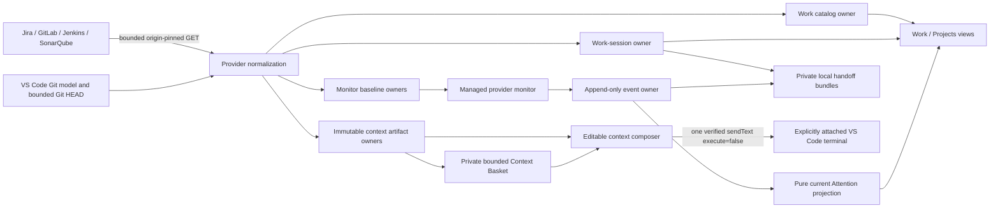

# Kronos State Ownership and Data Flow

Kronos normalizes data at provider, file, and webview-message ingress. Views consume canonical records and do not repair ambiguous identities. The terminal remains operator-owned and is never represented as a persisted process owner.

## Record ownership

| Record or state | Sole write owner | Canonical ingress and bounds | Compatibility and failure behavior | Consumers |
| --- | --- | --- | --- | --- |
| Provider environment | `providerEnv.ts` | Allowlisted keys; bounded private UTF-8 file; process environment values already present win | Missing file is valid; malformed keys are skipped; target and ancestor links are rejected; values are never rendered or copied into other records | Provider clients, readiness |
| Work catalog | `stateStore.ts`, coordinated by `TerminalFirstState.ts` | `work.json`; schema v2; 32 MiB; private bounded atomic replacement | Schema v1 launch links migrate once at read; legacy project tags are ignored; unsupported future schemas and corrupt files fail closed with visible issues | Work, Projects, Setup, provider target reconciliation |
| Jira refresh lifecycle | `TerminalFirstState.ts` | In-memory `idle/loading/complete/partial/error` snapshot with bounded redacted detail | A failed or partial read retains the prior catalog; another window's catalog write resets local transient status to idle; stale is derived from catalog time and configured interval | Work tree and Jira board |
| In-flight Work refresh | `WorkRefreshCoordinator.ts` | One in-memory abort controller and active read | Scheduled overlap coalesces; a newer explicit request supersedes; disposal aborts | Extension Work command orchestration |
| Registered local project | `projectCatalog.ts` through `TerminalFirstState.ts` | Canonical name plus real configured path; shared ingress normalization for GitLab identity, credential-free Jenkins URL, SonarQube key, and conservative branch names | Setup rejects malformed values; persisted malformed/ambiguous config is omitted before consumers see it; a Jira namespace never becomes a local project; registration is authoritative only after explicit selection | Work, Projects, Sessions, project provider setup |
| Ticket-to-project link | `projectCatalog.ts` through `TerminalFirstState.ts` | One optional `linked_local_project` referencing a registered path | No default or inferred link; schema-v1 `launch_project` migrates; unlink changes only Kronos metadata and session project metadata | Launch cwd, provider target selection, Work filters |
| Work session and terminal-binding history | `workSessionStore.ts` | One private JSON record per session; schema v2; 4 MiB; normalized IDs, ticket keys, timestamps, bindings, artifacts, and monitoring status | Unsupported/corrupt/oversized records are omitted and reported; reload never reclaims a terminal by saved name or PID; removal deletes only colocated session state | Sessions, Attention correlation, polling, audit |
| Live terminal object attachment | `operatorTerminalRegistry.ts` | In-memory exact VS Code terminal object plus session/binding identity | Never persisted; cleared on reload; no transcript access; detach and stop-management never close the terminal | Focus, target verification, context placement |
| Provider binding | `workSessionStore.ts` | Embedded bounded normalized provider/resource/subject/project/URL record with attachment time | Semantic replacement prevents duplicate bindings; provider URLs are normalized and origin-safe before use; newest valid durable MR binding owns MR identity | Polling, Work projection, Attention, context reads |
| MR, pipeline, read-health, and CI baselines | The matching `*MonitorStore.ts` or transition service | Private bounded normalized digest files under the session; shared atomic file primitive | Incomplete reads retain last complete facets; malformed, symbolic, oversized, or identity-raced state fails closed; no raw provider response is stored | Managed provider monitor and transition comparison |
| Provider transition reconciliation | `providerTransitionRecorder.ts`, with read normalization in `providerReadHealth.ts` | Deterministic event ID plus newest normalized provider-read state | Exact events and unchanged read-health signatures are suppressed; actual recovery/change appends | Attention, audit, monitoring summaries |
| Current Attention projection | `attentionProjection.ts` | Pure rebuild from bounded normalized transition/acknowledgement records plus canonical session identity | Selects the newest event per canonical stream before applying acknowledgement, so restart is deterministic and an acknowledged newest row cannot resurrect stale history | Attention tree |
| Provider health visibility | `workSessionStore.ts`, projected by `providerMonitoringHealth.ts` | Per-session attempt/success/change/error/suppression fields; project values are derived | Missing additive fields remain valid; legacy successful polls are used only when their failure count was zero | Sessions and Projects |
| Monitoring lease | `managedMonitorLease.ts` | One exclusive private lease per `KRONOS_DIR`, bounded owner/expiry record, renewable pins | POSIX requires `O_NOFOLLOW`; Windows uses exclusive creation and lstat/fstat identity checks; loss of ownership stops persistence and the next provider read | Managed provider monitor |
| Monitor and audit event ledger | `monitorEventStore.ts` | Append-only bounded JSONL records with canonical event, session, source, subject, state, and metadata fields | Invalid lines are skipped; reads are bounded tails; Attention projects newest state but never deletes history | Attention, session audit |
| Jira, GitLab, CI, and Git context artifacts | The matching `*ContextStore.ts` | Private content-addressed immutable JSON/Markdown pair, or one immutable Git artifact; byte and collection caps; SHA-256 identity | Existing content must match; incomplete pairs are refused; raw Jira attachments are immutable private bytes and are never parsed | Composer, session artifact reference, terminal reference |
| Context Basket selections and bundles | `contextBasketStore.ts` | `context-basket.json` schema v1; at most 20 reference-only entries and 256 KiB; selected artifacts must remain inside `KRONOS_DIR`; immutable bundle contains paths, hashes, provenance, freshness, completeness, size, conflicts, warnings, and operator focus | Unsupported/corrupt state fails closed; exact artifacts deduplicate; changed hashes for one source remain visible as conflicts; remove/clear never deletes source artifacts; refresh is explicit | Context Basket webview, session artifact reference, terminal reference, audit |
| Local evidence search index | `localEvidenceSearch.ts` | Ephemeral rebuild-on-open metadata projection; at most 2,000 entries across separately capped projects, sessions, ticket contexts, provider bindings, artifacts, and audit events | Never persisted, so closing/reloading removes it; every search rebuilds from current private canonical state; terminal bindings and contents are not accepted as inputs | Native VS Code Quick Pick and bounded result actions |
| Local handoff bundle | `handoffBundleStore.ts` | Immutable private Markdown/JSON pair; at most 100 selections from capped context/audit candidates; 2 MiB per file; context paths must remain inside `KRONOS_DIR`; all text is credential-redacted | Missing/external context references, incomplete immutable pairs, invalid timestamps, and oversized selections fail closed; source payloads and terminal content are never copied | Operator-opened local document, audit decision reference |
| Project branch profiles | `projectCatalog.ts` through `TerminalFirstState.ts`, normalized at `stateStore.ts` ingress | At most 20 exact branch profiles per explicitly registered project; each may carry a normalized Jenkins URL and/or SonarQube key/branch plus one optional active fallback | Duplicate/unsafe branches, credential URLs, unknown active profiles, and malformed persisted entries are rejected or omitted; profiles never create a ticket link or switch Git | Project setup, Jenkins/SonarQube target selection |
| Setup and Doctor readiness | `operationsReadiness.ts` from `providerReadiness.ts` and local state issues | Computed secret-free snapshot; no persistence | Missing, present-needs-test, invalid, unavailable, and ready remain distinct; both views receive the same snapshot | Setup and Doctor |
| Webview message | `webviewMessages.ts` plus the owning runtime handler | Allowlisted command and bounded identity/focus fields only | Unknown fields and commands are dropped; ticket/project/session identity is resolved again against current canonical state before action | Ticket workspace, Jira board, Setup, Doctor, composers |

## Canonical value rules

- `undefined` means an optional value was not supplied or is not applicable. It does not mean a provider read succeeded with an empty result.
- Unavailable optional provider evidence is represented in a completeness block, not by inventing data.
- Partial reads retain valid fetched components, list bounded warnings, and never erase a prior complete facet merely because a later endpoint was unavailable.
- Provider timestamps, issue keys, project identifiers, branches, URLs, paths, and hashes are normalized at ingress. Project setup and `work.json` reads share the same GitLab, Jenkins, SonarQube, and branch validators, including one-of GitLab ID/path precedence. Internal consumers use those canonical values instead of probing alternate spellings.
- Unknown provider fields are ignored after the bounded fields needed by Kronos are selected. Unknown persisted fields are ignored only within a supported schema version.
- Unsupported future persisted schemas fail closed. Compatibility aliases exist only at documented migration boundaries and are not written back as current fields.
- Mutable records use same-directory bounded atomic replacement. Append-only events use the shared complete-record append/tail boundary. Content artifacts use immutable no-replace publication.

## Mutation boundaries

Kronos mutates only its private local state and, after an explicit operator action, a VS Code terminal input buffer. It does not mutate Jira, GitLab, Jenkins, SonarQube, Git, a project database, or terminal process state. The only terminal writes are the validated Claude launch path and one reviewed `sendText(..., false)` context placement path.
