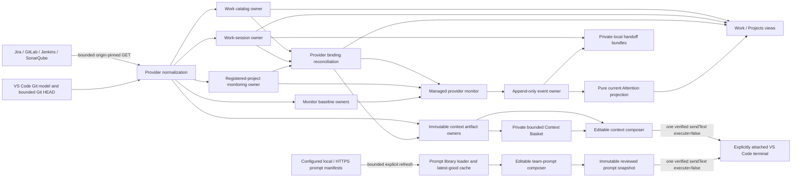

# Kronos State Ownership and Data Flow

Kronos normalizes data at provider, file, and webview-message ingress. Views consume canonical records and do not repair ambiguous identities. The terminal remains operator-owned and is never represented as a persisted process owner.

## Record ownership

| Record or state | Sole write owner | Canonical ingress and bounds | Compatibility and failure behavior | Consumers |
| --- | --- | --- | --- | --- |
| Provider environment | `providerEnv.ts` | Allowlisted keys; bounded private UTF-8 file; process environment values already present win | Missing file is valid; malformed keys are skipped; target and ancestor links are rejected; values are never rendered or copied into other records | Provider clients, readiness |
| Prompt-library configuration and remote cache | `promptLibrary.ts` | Two VS Code string-array settings; at most 20 local paths, 10 remote URLs, 20 eligible files per directory, 100 prompts per library, 500 prompts total, 1 MiB per manifest, 20,000 characters per body, and a 10-second remote timeout | Local paths are read-only; remote URLs require HTTPS or loopback HTTP, no userinfo/sensitive query/hash/redirect, and origin-exact GitLab credential use only in trusted workspaces; failed remote refresh may use the private latest-good manifest; manifest text is data-only and credential-redacted | Setup/Doctor readiness, prompt Quick Pick, prompt composer |
| Work catalog | `stateStore.ts`, coordinated by `TerminalFirstState.ts` | `work.json`; schema v2; 32 MiB; private bounded atomic replacement | Schema v1 launch links migrate once at read; legacy project tags are ignored; unsupported future schemas and corrupt files fail closed with visible issues | Work, Projects, Setup, provider target reconciliation |
| Legacy data-home migration | `legacyStateMigration.ts` | One private target-sibling staging tree; at most 20,000 entries and 2 GiB; files become `0600` and directories `0700` on POSIX | The live target remains absent until the complete staged tree passes no-symlink/type/size validation; detected target collisions never overwrite either owner; cross-device copy retains the legacy recovery source; failed staging cleanup never promotes partial state | Default-path startup only |
| Jira refresh lifecycle | `TerminalFirstState.ts` | In-memory `idle/loading/complete/partial/error` snapshot with bounded redacted detail | A failed or partial read retains the prior catalog; another window's catalog write resets local transient status to idle; stale is derived from catalog time and configured interval | Work tree and Jira board |
| In-flight Work refresh | `WorkRefreshCoordinator.ts` | One in-memory abort controller and active read | Scheduled overlap coalesces; a newer explicit request supersedes; disposal aborts | Extension Work command orchestration |
| Public command route | `terminalFirstCommandRouter.ts` | Exact manifest-matched command ID mapped to one Work, terminal, context, Session, Project, Attention, or operations callback | Missing callbacks fail registration closed; the pure router owns no workflow state and imports no VS Code API; activation supplies behavior callbacks through one audited registrar | Extension activation and command handlers |
| Registered local project | `projectCatalog.ts` through `TerminalFirstState.ts` | Stable catalog key plus canonical real path and a separate optional nickname stored as `display_name`; shared ingress normalization for GitLab identity, credential-free Jenkins URL, SonarQube key, and conservative branch names | Duplicate canonical paths collapse to one identity; nickname set/clear never rewrites ticket/session links; Setup rejects malformed values; a Jira namespace never becomes a local project; saving valid provider setup requests an immediate project-owned poll | Work, Projects, Sessions, Attention, project provider setup |
| Ticket-to-project link | `projectCatalog.ts` through `TerminalFirstState.ts` | One optional `linked_local_project` referencing a registered path | No default or inferred link; schema-v1 `launch_project` migrates; unlink changes only Kronos metadata and Session project metadata; the link projects provider facts onto a ticket but never creates polling authority | Launch cwd, ticket provider projection, Work filters |
| Registered-project monitoring owner | `projectMonitoringStore.ts` | One private bounded `project-monitor.json` record under a deterministic project-monitor directory; no `session.json`; normalized project path, provider bindings, and health | Exists only for a registered project with configured provider targets; never appears in Sessions or invents Jira/terminal identity; newer compatible legacy bindings may seed migration; corrupt state fails closed | Managed polling, Projects health, Attention ownership, project provider insertion |
| Work session and terminal-binding history | `workSessionStore.ts` | One private JSON record per Session; schema v2; 4 MiB; normalized IDs, ticket keys, timestamps, bindings, artifacts, and monitoring status | Unsupported/corrupt/oversized records are omitted and reported; reload never reclaims a terminal by saved name or PID; removal deletes only colocated Session state; configured-project polling survives Session removal | Sessions, terminal insertion, legacy polling fallback, audit |
| Live terminal object attachment | `operatorTerminalRegistry.ts` | In-memory exact VS Code terminal object plus session/binding identity | Never persisted; cleared on reload; no transcript access; detach and stop-management never close the terminal | Focus, target verification, context placement |
| Provider binding | `workSessionStore.ts` and `projectMonitoringStore.ts` through shared pure binding rules | Embedded bounded normalized provider/resource/subject/project/URL record with attachment time | Semantic replacement prevents duplicate bindings; provider URLs are normalized and origin-safe before use; registered-project binding is canonical while Session binding remains insertion and migration evidence | Polling, Work projection, Projects, Attention, context reads |
| Provider binding reconciliation | `providerBindingReconciliation.ts` | Pure reconciliation of the explicit project configuration, durable session bindings, Work projection, matching monitor digest, and resource-specific provider targets | Durable MR identity wins stale catalog data; only the same MR digest may enrich it; discovery and ambiguous-result policy stay outside views; provider URLs are credential-free and pinned to the configured origin | Work, Sessions, Projects, Attention, polling, context reads |
| MR, pipeline, read-health, and CI baselines | The matching `*MonitorStore.ts` or transition service | Private bounded normalized digest files under the project-monitor owner or legacy Session; shared atomic file primitive | Incomplete reads retain last complete facets; malformed, symbolic, oversized, or identity-raced state fails closed; no raw provider response is stored | Managed provider monitor and transition comparison |
| Provider transition reconciliation | `providerTransitionRecorder.ts`, with read normalization in `providerReadHealth.ts` | Deterministic event ID plus newest normalized provider-read state | Exact events and unchanged read-health signatures are suppressed; actual recovery/change appends | Attention, audit, monitoring summaries |
| Current Attention projection | `attentionProjection.ts` | Pure rebuild from bounded normalized transition/acknowledgement records plus canonical session identity | Selects the newest event per canonical stream before applying acknowledgement, so restart is deterministic and an acknowledged newest row cannot resurrect stale history | Attention tree |
| Provider health visibility | `projectMonitoringStore.ts` or legacy `workSessionStore.ts`, projected by `providerMonitoringHealth.ts` | Per-owner attempt/success/change/error/suppression fields | Missing additive fields remain valid; configured Projects prefer their canonical monitor health; legacy Session health is fallback only | Projects, linked ticket workspaces, legacy Sessions |
| Monitoring lease | `managedMonitorLease.ts` | One exclusive private lease per `KRONOS_DIR`, bounded owner/expiry record, renewable pins | POSIX requires `O_NOFOLLOW`; Windows uses exclusive creation and lstat/fstat identity checks; loss of ownership stops persistence and the next provider read | Managed provider monitor |
| Monitor and audit event ledger | `monitorEventStore.ts` | Append-only bounded JSONL records with canonical event, session, source, subject, state, and metadata fields | Invalid lines are skipped; reads are bounded tails; Attention projects newest state but never deletes history | Attention, session audit |
| Jira, GitLab, CI, and Git context artifacts | The matching `*ContextStore.ts` | Private content-addressed immutable JSON/Markdown pair, or one immutable Git artifact; byte and collection caps; SHA-256 identity | Existing content must match; incomplete pairs are refused; Jira attachment identity/bytes/hash/count and the full normalized envelope are validated before any context file is published; raw Jira attachments are immutable private bytes and are never parsed | Composer, session artifact reference, terminal reference |
| Reviewed team-prompt snapshot | `promptLibraryArtifactStore.ts` | Private content-addressed immutable JSON/Markdown pair containing the reviewed redacted body, source revision, filled context, and warnings; 20,000-character body | Created only by explicit Place in Terminal; exact attachment is revalidated before insertion; duplicate placement creates no second snapshot; manifest commands/unknown variables have no authority and credentials are redacted | Session artifact reference, terminal reference, audit |
| Context Basket selections and bundles | `contextBasketStore.ts` | `context-basket.json` schema v1; at most 20 reference-only entries and 256 KiB; selected artifacts must remain inside `KRONOS_DIR`; immutable bundle contains paths, hashes, provenance, freshness, completeness, size, conflicts, warnings, and operator focus | Unsupported/corrupt state fails closed; exact artifacts deduplicate; changed hashes for one source remain visible as conflicts; bundle publication rereads every selected source and refuses missing, size-changed, hash-changed, or malformed-hash evidence; remove/clear never deletes source artifacts; refresh is explicit | Context Basket webview, session artifact reference, terminal reference, audit |
| Local evidence search index | `localEvidenceSearch.ts` | Ephemeral rebuild-on-open metadata projection; at most 2,000 entries across separately capped projects, sessions, ticket contexts, provider bindings, artifacts, and audit events | Never persisted, so closing/reloading removes it; every search rebuilds from current private canonical state; terminal bindings and contents are not accepted as inputs | Native VS Code Quick Pick and bounded result actions |
| Local handoff bundle | `handoffBundleStore.ts` | Immutable private Markdown/JSON pair; at most 100 selections from capped context/audit candidates; 2 MiB per file; context paths must remain inside `KRONOS_DIR`; all text is credential-redacted | Missing/external context references, incomplete immutable pairs, invalid timestamps, and oversized selections fail closed; source payloads and terminal content are never copied | Operator-opened local document, audit decision reference |
| Project branch profiles | `projectCatalog.ts` through `TerminalFirstState.ts`, normalized at `stateStore.ts` ingress | At most 20 exact branch profiles per explicitly registered project; each may carry a normalized Jenkins URL and/or SonarQube key/branch plus one optional active fallback | Duplicate/unsafe branches, credential URLs, unknown active profiles, and malformed persisted entries are rejected or omitted; profiles never create a ticket link or switch Git | Project setup, Jenkins/SonarQube target selection |
| Setup and Doctor readiness | `operationsReadiness.ts` from `providerReadiness.ts` and local state issues | Computed secret-free snapshot; no persistence | Missing, present-needs-test, invalid, unavailable, and ready remain distinct; both views receive the same snapshot | Setup and Doctor |
| Operation-stage outcome | `operationStageOutcome.ts` | Ephemeral ordered provider-read, artifact-write, snapshot, insertion, session-update, and audit states; controlled details are bounded/redacted and arbitrary failures use `boundedOperationFailure` | A successful insertion is never rolled back or reported as failed by later local evidence work; session and audit writes are attempted independently; absent steps stay explicit as skipped or not attempted | Context composer, Context Basket, notifications, logs, failure regressions |
| Webview message | `webviewMessages.ts` plus the owning runtime handler | Allowlisted command and bounded identity/focus fields only | Unknown fields and commands are dropped; ticket/project/session identity is resolved again against current canonical state before action | Ticket workspace, Jira board, Setup, Doctor, composers |

## Private persistence lifecycle matrix

All private runtime paths are rooted below `KRONOS_DIR`. “Atomic” means a bounded same-directory exclusive temporary file is flushed and renamed only after path/descriptor identity checks. “Immutable” means an exclusive no-replace publication whose existing content must match. Windows omits unsupported POSIX flags in `privateFilePrimitives.ts` and compensates with complete lstat/fstat identity checks; POSIX requires `O_NOFOLLOW`.

| File family | Owner and schema | Size bound | Publication behavior | Cleanup lifecycle |
| --- | --- | --- | --- | --- |
| Provider environment | `providerEnv.ts`; allowlisted line format, no copied credential schema | 256 KiB | Bounded private read; Kronos may create one exclusive comment-only template but never rewrites operator values | Shared configuration; never removed with a session |
| Work catalog (`work.json`) | `stateStore.ts`; schema v2 | 32 MiB | Bounded atomic replacement; malformed, partial, oversized, symbolic, or future-schema input returns an empty canonical projection plus a visible issue | Shared catalog; retained until the operator removes the Kronos state root |
| Work-session record (`work-sessions/*/session.json`) | `workSessionStore.ts`; schema v1 | 4 MiB per record | Bounded atomic replacement; invalid records are omitted and reported; artifact references are re-confined to `KRONOS_DIR` on every read | Explicit Remove Session deletes only that session directory and its colocated snapshots |
| Managed-monitor lease (`leases/managed-monitor-poll.lease`) | `managedMonitorLease.ts`; strict schema v1 | 4 KiB | Exclusive creation, identity-pinned renewal/release, bounded complete reads, active-owner refusal, and expired-owner reclamation | Released after every poll and immediately on runtime disposal; an expired safe owner may be reclaimed |
| MR, pipeline, read-health, and CI snapshots | Matching `*MonitorStore.ts`; normalized schema v1 digests/status | 256 KiB per snapshot | Bounded atomic replacement through the shared private-file primitive; corrupt or unsupported input is refused and cannot erase a prior complete in-memory facet | Colocated with one work session and removed only with that session record |
| Monitor/audit ledger (`monitor-events.jsonl`) | `monitorEventStore.ts`; schema v1 per event | 16 KiB per event; 5 MiB default and 50 MiB maximum bounded tail read | One flushed append record after path/descriptor identity checks; incomplete tail lines, external artifact references, and invalid events are skipped | Shared append-only evidence; retained after session removal |
| Jira, GitLab, and CI context pairs | Matching `*ContextStore.ts`; schema v1 JSON plus Markdown | 12 MiB JSON and 13 MiB prompt per pair | Immutable content-addressed pair; incomplete pre-existing pairs fail closed | Shared evidence; session removal deletes only its reference, not the artifact |
| Raw Jira attachments | `jiraContextStore.ts`; byte-for-byte provider payload plus hashed metadata | 100 MiB per stored attachment, with separate count/total fetch caps | All captures and completeness metadata are prevalidated before directory/file publication; immutable private bytes are never parsed, previewed, or executed | Shared evidence; retained after session removal |
| Local Git context | `projectGitContextStore.ts`; bounded Markdown evidence | 768 KiB | Immutable content-addressed publication | Shared evidence; retained after session removal |
| Prompt-library remote cache | `promptLibrary.ts`; one bounded manifest per URL hash | 1 MiB per configured remote manifest | Private atomic latest-good replacement only after validation; no redirects or credential-bearing URL; unavailable remote reads may reuse it explicitly | Shared cache; retained independently of sessions |
| Reviewed prompt context | `promptLibraryArtifactStore.ts`; schema v1 Markdown/JSON | 20,000-character reviewed body plus bounded metadata | Immutable content-addressed pair; credential-shaped text is redacted before publication | Shared evidence; session removal deletes only its reference |
| Context Basket | `contextBasketStore.ts`; schema v1 | 256 KiB state; referenced artifacts retain their own caps | Bounded atomic reference-only state plus immutable bundle publication | Remove/Clear deletes selections only and never source artifacts |
| Local handoff pair | `handoffBundleStore.ts`; schema v1 Markdown/JSON | 2 MiB per file | Immutable private pair; incomplete or external selections fail closed | Operator-owned local evidence; no provider/session cleanup deletes it |

Ephemeral local search has no persisted index. Terminal objects, terminal text, provider response bodies, and credentials are never persistence inputs.

## Canonical Attention transition key

Every provider state belongs to one canonical Attention stream identified by **scope + provider + resource + logical subject + facet**. Scope is the stable registered-project identity when available and otherwise the work-session identity. MR IIDs and SonarQube project/branch pairs remain independent logical subjects; pipeline IDs and Jenkins build numbers are occurrences, so a newer occurrence replaces the stale row for its MR pipeline or configured job. Provider-read health remains a separate facet from the resource's state/review facet.

Baseline records, meaningful transitions, acknowledgements, open-MR reminders, and the current Attention projection all retain or recompute this same key. The append-only audit keeps every record, while projection first selects the newest transition per stream and only then applies acknowledgement. This ordering makes reload and restart deterministic and prevents an older state from resurfacing after the newest state is cleared.

## Canonical value rules

- `undefined` means an optional value was not supplied or is not applicable. It does not mean a provider read succeeded with an empty result.
- Unavailable optional provider evidence is represented in a completeness block, not by inventing data.
- Partial reads retain valid fetched components, list bounded warnings, and never erase a prior complete facet merely because a later endpoint was unavailable.
- Provider timestamps, issue keys, project identifiers, branches, URLs, paths, and hashes are normalized at ingress. Project setup and `work.json` reads share the same GitLab, Jenkins, SonarQube, and branch validators, including one-of GitLab ID/path precedence. Internal consumers use those canonical values instead of probing alternate spellings.
- Unknown provider fields are ignored after the bounded fields needed by Kronos are selected. Unknown persisted fields are ignored only within a supported schema version.
- Unsupported future persisted schemas fail closed. Compatibility aliases exist only at documented migration boundaries and are not written back as current fields.
- Mutable records use same-directory bounded atomic replacement. Append-only events use the shared complete-record append/tail boundary. Content artifacts use immutable no-replace publication.

## Mutation boundaries

Kronos mutates only its private local state and, after an explicit operator action, a VS Code terminal input buffer. It does not mutate Jira, GitLab, Jenkins, SonarQube, Git, a project database, or terminal process state. The only terminal writes are the validated Claude launch path and one reviewed `sendText(..., false)` context placement path.
